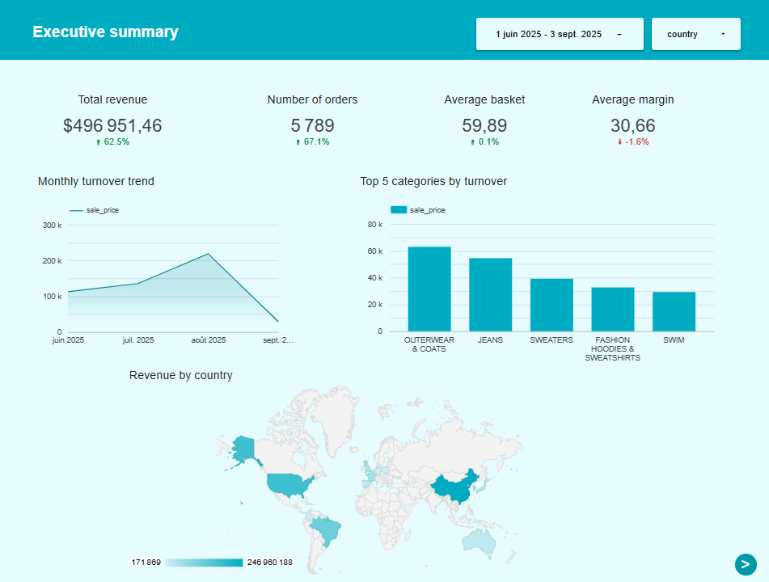
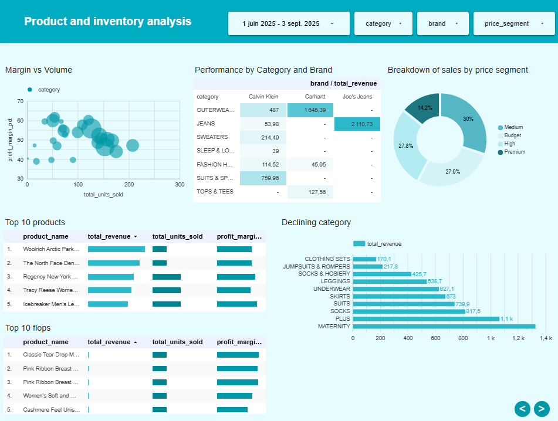
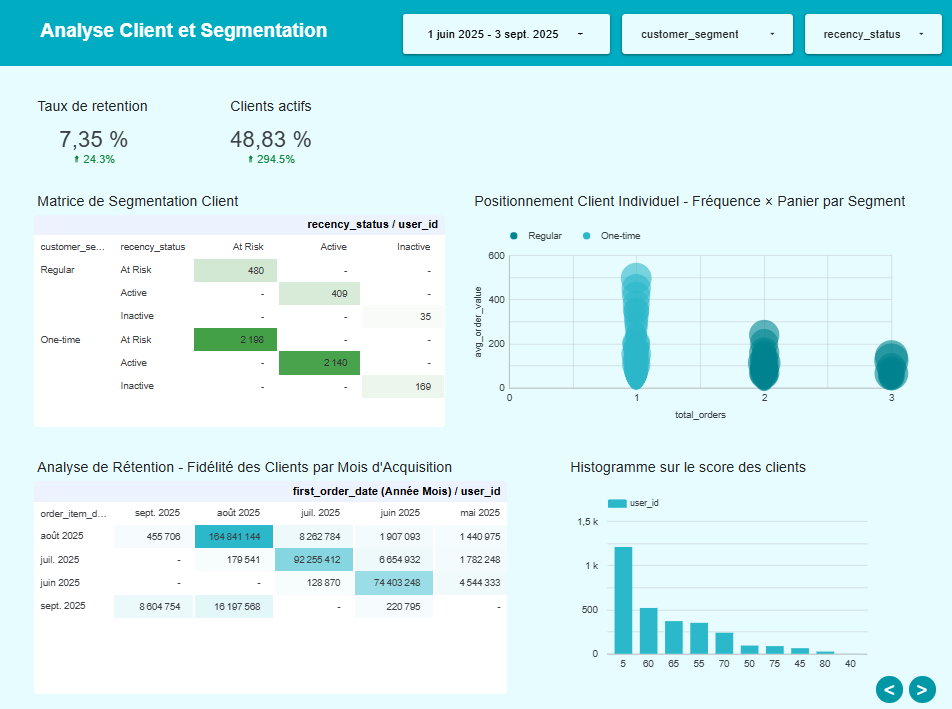
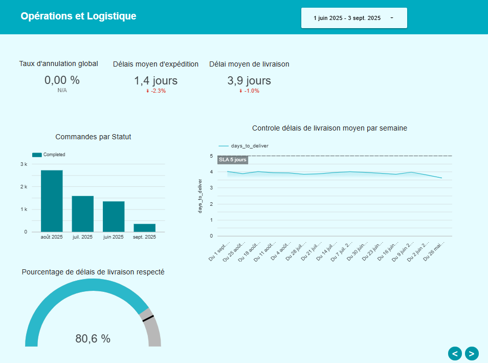
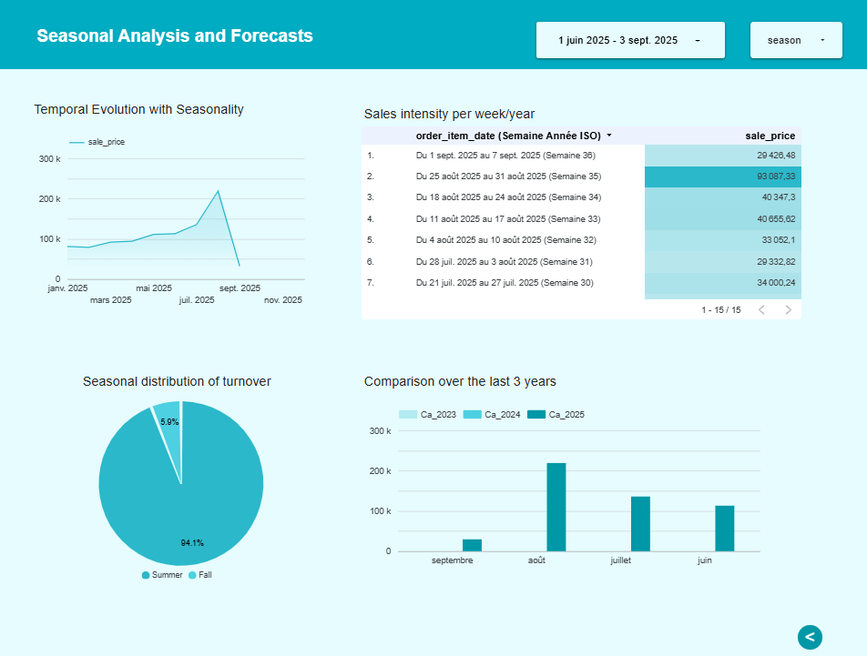

# TheLook E-commerce Analytics - dbt Project

## 📋 Overview

This dbt project transforms raw data from TheLook E-commerce into analytical models ready for Looker. It follows a 3-layer architecture (staging → intermediate → marts).

## 🎯 Project objective

Learn by creating a project with BI tools:
- **dbt** for data transformation
- **BigQuery** as a data warehouse
- **Looker** for visualisation

## 🏗️ Simplified architecture

```
models/
├── staging/          # 🧹 Raw data cleaning
│   ├── stg_users.sql         # Customers with age_group, gender_clean
│   ├── stg_orders.sql        # Orders with normalised statuses  
│   ├── stg_order_items.sql   # Items with cleaned prices
│   └── stg_products.sql      # Products with margin calculations
│
├── intermediate/     # 🔄 Business aggregations
│   ├── int_user_orders.sql   # Metrics per customer (RFM)
│   └── int_product_metrics.sql # Performance per product
│
└── marts/           # 📊 Final tables for Looker
    ├── dim_users.sql         # Enriched customer dimension
    ├── dim_products.sql      # Product dimension with KPIs  
    └── fact_sales.sql        # Sales facts (analytical core)
```

## 🎯 Available Business Metrics

### 👥 Customer Analysis
- **RFM Segmentation**: VIP (10+ orders, £500+ turnover) → One-time
- **Last order status**: Active (≤30 days) → Lost (>180 days)
- **Average basket size** and purchase frequency

### 🛍️ Product Performance  
- **Automatic classification**: Star → Underperformer (based on turnover/volume)
- **Profitability**: Gross margin, total profit per product
- **Activity status**: Active → Discontinued

### 💰 Financial Metrics
- **Revenue** by period/segment/channel
- **Profit** and margins per transaction
- **Discounts** applied vs retail price
- **Seasonality** of sales

## 🚀 Deployment (3 commands)

```bash
# 1. Check configuration
dbt debug

# 2. Build all models  
dbt run

# 3. Test data quality
dbt test
```

## 🧪 Data quality

Automatic tests included:
- **Uniqueness** of primary keys 
- **Consistency** of references (user_id, product_id)
- **Non-nullity** of critical fields (sale_price, order_date)

## 💡 Technical highlights

✅ **Scalable architecture**: staging → intermediate → marts  
✅ **Modularity**: Each layer has a specific role  
✅ **Performance**: Views for staging, tables for marts  
✅ **Documentation**: Explanatory comments in each model  

---

**Technologies**: dbt-core, BigQuery, SQL, Looker  
**Dataset**: TheLook E-commerce (BigQuery public data) 


## 📊 Looker Studio 

# LookML file
As I did not have access to Looker, I created every file I might need in the **LookML** folder.
This helped me understand the LookML syntax.

# Looker Studio Dashboard

**Name**: DBT_Ecommerce_Analysis    
**Link**: https://lookerstudio.google.com/s/go-DJ2ZVvz0  
**Structure**:  
1. Analytical summary
<p align="centre">
  
</p>  
2. Product and inventory analysis
<p align="centre">
  
</p>  
3. Customer analysis and segmentation
<p align="centre">
  
</p>  
4. Operations and Logistics
<p align="centre">
  
</p>  
5. Seasonal Analysis and Forecasting
<p align="centre">
  
</p>  


